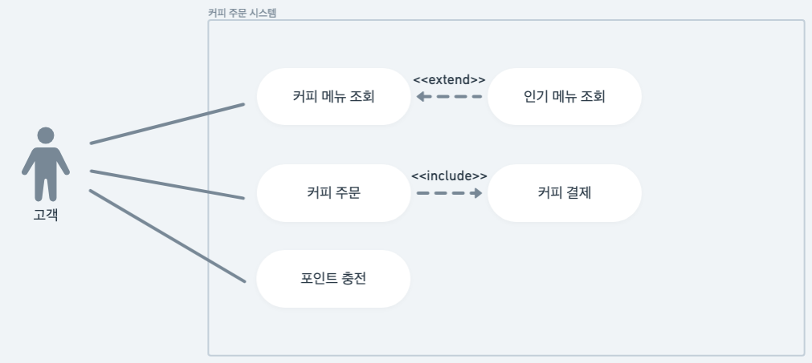

# 커피 주문 시스템

* 커피 메뉴를 조회하고 주문하는 일련의 과정을 구현
* 동시성 이슈를 고려하여 구현
* TDD 방법론을 적용하여 개발

## 유즈케이스 다이어그램

## API 명세서
https://documenter.getpostman.com/view/25428915/2sB2xBBp4T

## ✅ 커밋 메시지 컨벤션

형식:
imoji type(scope): subject

### type
- feat: 새로운 기능
- fix: 버그 수정
- chore: 빌드/설정 변경
- docs: 문서 관련
- style: 코드 포맷팅 (기능 변화 없음)
- refactor: 리팩토링
- test: 테스트 코드

### 예시
- ✨ feat(user): 회원가입 기능 추가
- 🐛 fix(order): 주문 수량 계산 오류 수정
- 🔧 chore: spotless 설정 추가

| Type     | Emoji | 설명           |
| -------- | ----- | ------------ |
| feat     | ✨     | 새로운 기능       |
| fix      | 🐛    | 버그 수정        |
| docs     | 📝    | 문서 관련 수정     |
| style    | 🎨    | 포맷팅, 들여쓰기 등  |
| refactor | ♻️    | 리팩토링         |
| chore    | 🔧    | 설정, 빌드, 잡일 등 |
| test     | ✅     | 테스트 코드 추가    |
| remove   | 🔥    | 코드/파일 제거     |
| perf     | 🚀    | 성능 개선        |
| security | 🔒    | 보안 관련        |
